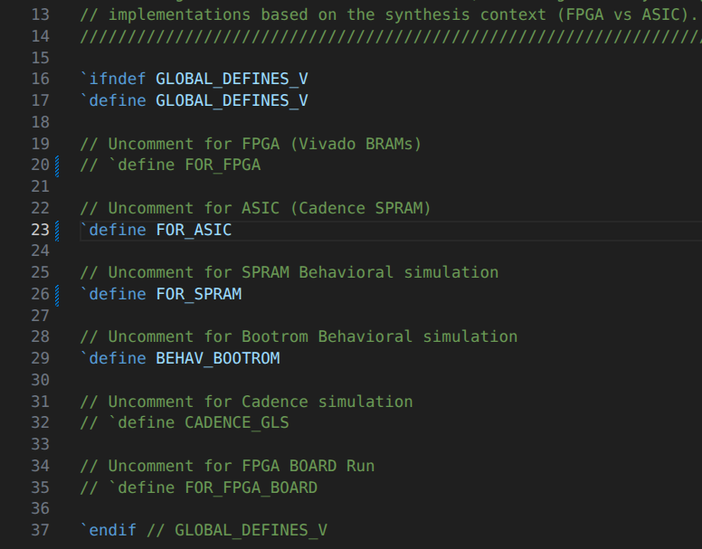
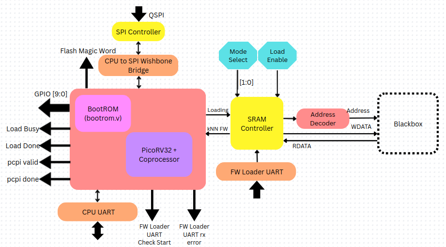

# RTL Configuration for ASIC Synthesis and Tapeout

When building for tapeout, only 1 specific configuration is supported. `global_defines.v` file should look like this:



Uncommenting `FOR_ASIC` will expose the IO pads added in design for tapeout.

> __NOTE:__ These IO pads are flagged as Syntax Error in Vivado and NONE of the testbenches mentioned in [__testbench-setup table__](../Testbench-Setup/testbench-setup.md#list-of-all-the-testbenches-and-their-corresponding-top-level-modules) will work.

This also makes the SPRAM Slice a blackbox with just input and output ports without any internal storage functionality.

Here is how the design will look like:



As mentioned before `vivado_proj_build.tcl` script sets `global_defines.v` and `uart_defines.v` files as __Global Include__ hence each file need not have an explicit line:

```verilog
`include "global_defines.v"

`include "uart_defines.v"
```

But these need to be added again in all RTL files when Synthesising in Cadence tools for tapeout.

---

## Steps to modify all the files

1. Place all the __/RTL__ files in a single folder.
2. Open a terminal and navigate to that folder.
3. Run the following grep command to find all the files that do not have `global_defines.v` included:

```bash
grep -r "global_defines.v"
```

Uncomment this line in all the files that do not have it included. By default they have been commented out in the RTL files.

As for now, currently these RTL files have global_defines.v included as commented out:

 - `SPRAM_1024x36.v`
 - `SPRAM_2048x36.v`
 - `SRAM_wrapper.v`
 - `Bootrom_wrapper.v`
 - `system.v`
 - `qflexpress_subsystem.v`
 - `magic_word_observability.v`
 - `s25fl128s.v`
 - `s25fl032p.v`
 - `W25Q16JV.v`

Change them from this:

```verilog
// `include "global_defines.v"
```

to this:

```verilog
`include "global_defines.v"
```
