# Coding Style for RTL Files
## Introduction
This is a short document describing the preferred coding style for all design and testbench RTL files. It is fair to say that coding style is very personal, and you may find code readable in one style but unreadable in another. Nevertheless, the intent of this document is to provide structure and uniformity, making the code portable across developers in the project. It also aims to minimize __linting__ and __synthesis__ warnings encountered during __ASIC tapeout__, which in turn helps ensure that the netlist generated during physical design is true to what was coded.

This document is partly inspired by the rules followed in the biggest and most important open source project in the world - __The Linux Kernel__.

---

## Table of Contents
- Ground Rules
- Directory Structure
- File Naming Conventions
- File Structure and Formatting
- Comments
- Writing Readable Code
- FSM Coding
- Testbenches
- Dealing with Open Source IPs
- Conclusion

---

## Ground Rules
### 1. Preferred File Type -
For starters, we split RTL files into 2 sets:
1) Design Files
2) Testbench files

As of 2026, the preferred file type for design files by Cadence is __Verilog (.v)__. It is important to note that __SystemVerilog (.sv)__ files are also accepted and are the industry standard, but for the sake of reliability and Cadence tool maturity with Verilog files, it is better to use `.v` files for all design files.

Testbenches, however, are recommended to be coded in __SystemVerilog (.sv)__ format, as SystemVerilog has multiple inbuilt functional and formal testing features missing in Verilog. Some of the key functional and formal testing features in SystemVerilog that do not exist in Verilog include __SystemVerilog Assertions (SVA)__, __Constrained Random Verification (CRV)__, __Functional Coverage (covergroups)__, and __Object-Oriented Programming (OOP)__ for testbench creation.

Thus, to summarize:
 - Design Files - Verilog (.v)
 - Testbench - SystemVerilog (.sv)

### 2. Indentation -
By default, the __tab size__ in most editors and projects is set to __4__. While this seems reasonable in most cases, the tab size should be __spaces__ for all RTL files must be __8__.

__Rationale:__ The whole idea behind indentation is to clearly define where a block of control starts and ends. Especially when you've been looking at your screen for 20 straight hours, you'll find it a lot easier to see how the indentation works if you have large indentations.

Now, some people will claim that having 8-character indentations makes the code move too far to the right and makes it hard to read. The answer to that is that if you need more than 3 levels of indentation, you have likely structured your code poorly. While this may not show any problems in simulation, the generated netlist is highly unpredictable, sometimes containing multiple muxes and additional buffers that add to the total delay in the signal path.

In short, 8-character indents make things easier to read and have the added benefit of warning you when you are nesting your functions too deeply.

### *Steps to Change Tab Size to 8 Spaces*
#### 1) Vivado:

- Go to __Tools__ > __Settings__ > __Text Editor__ > __Tab and Indents__
- Set __Tab Size__ to __8__
- Do NOT check the box __Use tab character__.
- Click __Apply__ and __OK__.

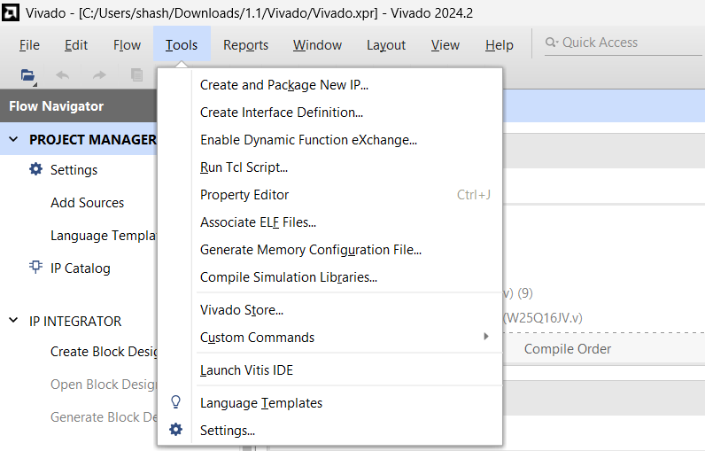
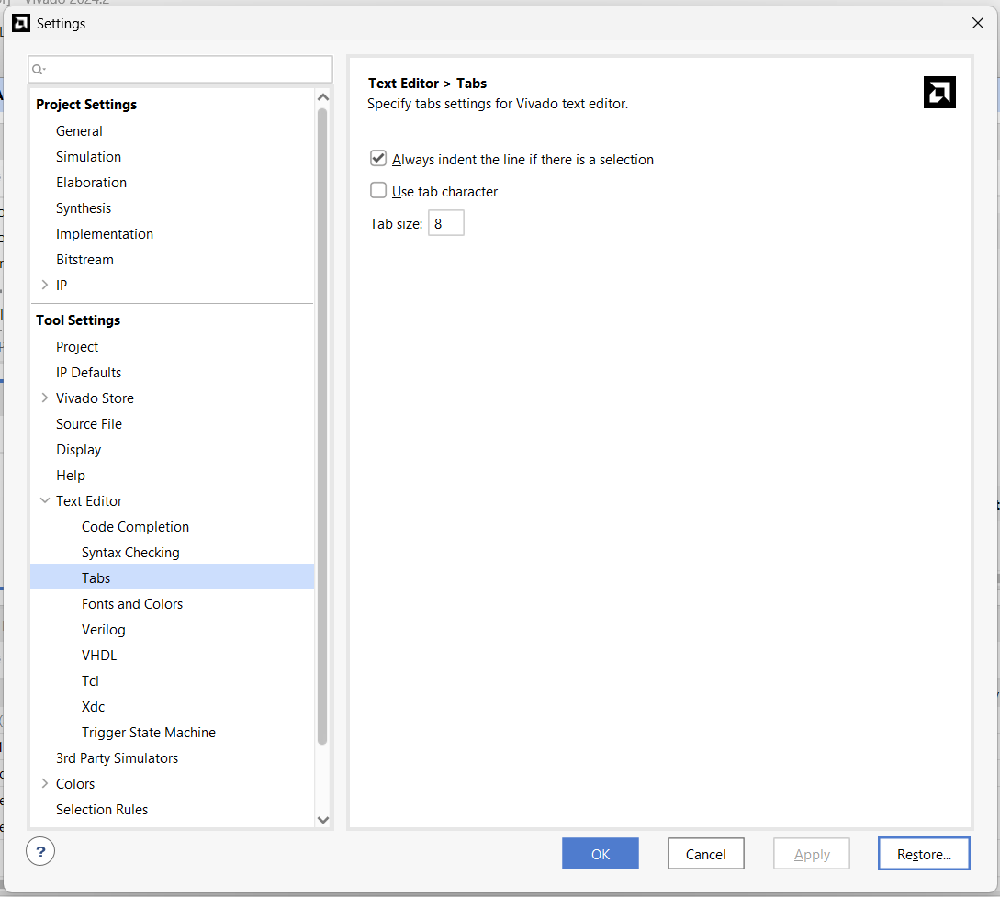

#### 2) Visual Studio Code:
- Open __Settings__ (File > Preferences > Settings)
- Search for __Tab Size__ in the search bar.
- Set __Tab Size__ to __8__.

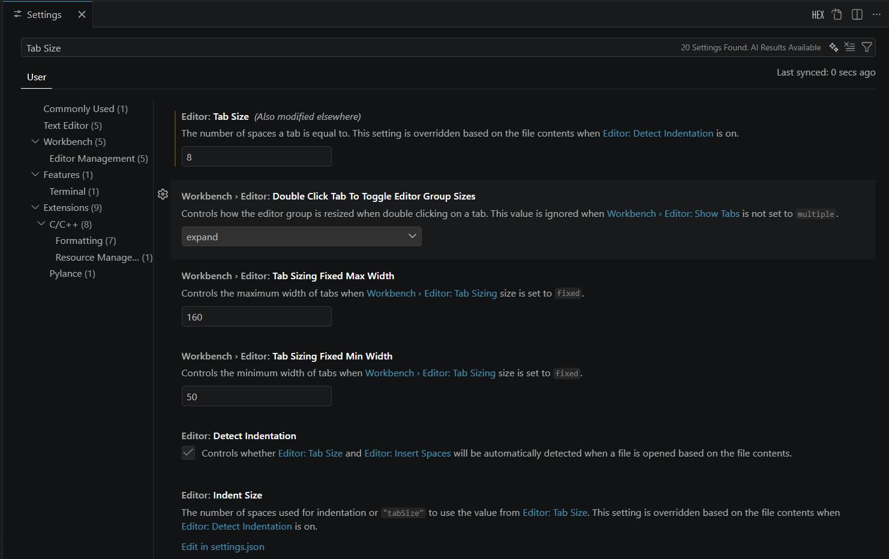

- Then search for __Insert Spaces__ in the search bar.
- Check the box __Insert Spaces__.

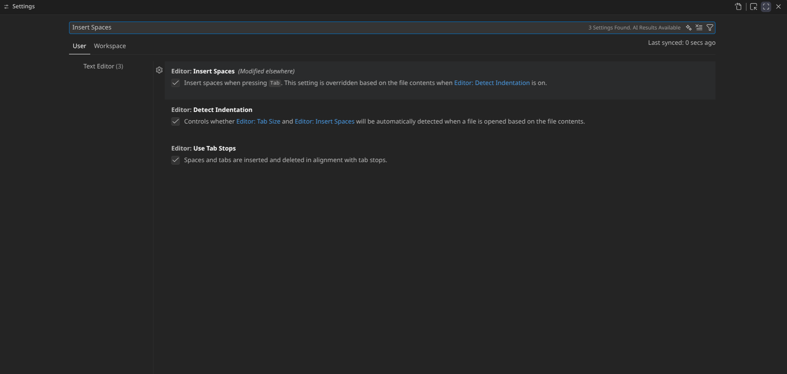

---

## Directory Structure
A well-organized directory structure is crucial for maintaining a clean and efficient codebase. It helps developers quickly locate files, understand the project layout, and promotes modularity.

You shouldn't have too many files in a single directory, as it can become overwhelming and difficult to navigate. Conversely, having too many nested directories can also make it hard to find files. A good rule of thumb is to aim for a balance, keeping related files together while avoiding excessive nesting.

For this project, we first separate the design files and testbench files into two main directories: `RTL/` and `TB/`.

To keep subfolders within `RTL/` simple, all files which are called by a wrapper module should be placed in the same folder as the wrapper module.

The folder is given same or similar name as the wrapper module.

Now, this folder (files + wrapper module) may be part of other wrapper modules with their own sets of files. Thus, this folder becomes a subfolder of the parent wrapper module's folder. This way, we can keep the directory structure simple and intuitive.

Here's an example of the directory structure:

```
project_root/
├── RTL/
│   ├── system.v
|   ├── <Respective .v files called directly by system.v>
|   ├── wrapper_module_1/
│       ├── wrapper_module_1.v // Calls wrapper_module_2 and wrapper_module_3
│       ├── file_a.v
│       ├── file_b.v
│       └── wrapper_module_2/
│           ├── wrapper_module_2.v
│           ├── file_c.v
│           └── file_d.v
|       └── wrapper_module_3/
│           ├── wrapper_module_3.v
│           ├── file_e.v
│           └── file_f.v
```

For the testbench, all files are kept in a single folder `TB/` as testbench files are not called by any wrapper module and are only used for testing purposes. This keeps the testbench directory simple and easy to navigate.

---

## File Naming Conventions
Consistent file naming conventions are essential for maintaining an organized codebase. They help developers quickly identify the purpose of a file and its relationship to other files in the project. Here are some guidelines for naming RTL files in this project:

1. __Use descriptive names__: File names should clearly indicate the purpose of the file. For example, if a file contains a module for an ALU, it could be named `alu.v`.
2. __Use lowercase letters and underscores__: To maintain consistency, use lowercase letters and underscores to separate words in file names. For example, `data_path.v` is preferred over `DataPath.v`.
3. __Avoid abbreviations__: While it may be tempting to use abbreviations to shorten file names, it can lead to confusion. Use full words to ensure clarity. For example, `control_unit.v` is preferred over `ctrl_unit.v`.
4. Wrapper modules should always use the suffix `_wrapper` or `_subsystem` in their name to clearly indicate their purpose. For example, `alu_wrapper.
v` for a wrapper module that instantiates the ALU.
5. The topmost wrapper need not have the suffix `_wrapper` or `_subsystem` as it is the top-level module and its purpose is clear from the context. For example, `system.v` for the top-level wrapper module that instantiates all other modules in the design.
6. __All testbench files__ should start with the prefix `tb_` to clearly indicate that they are testbench files. For example, `tb_alu.sv` for a testbench file that tests the ALU module.

### __NOTE:__
The module name inside the file should match the file name to maintain consistency and make it easier to identify the module associated with each file. For example, if the file is named `alu.v`, the module defined inside should be `module alu`.

---

## File Structure and Formatting
Uniformity in file structure helps maintain readability and makes it easier to debug and maintain the code.

Any (.v) design file should follow the following structure in this order:
1. `timescale 1ns / 1ps`
2. Comment Header
3. `define` statements (if any)
4. module declaration and I/O port list
5. Parameter declarations (if any)
6. `wire` and `reg` declarations
7. Instantiations of submodules (if any)
8. Sequential logic (always blocks)
9. Combinational logic (always blocks)
10. Continuous assignments (assign statements)
11. endmodule

### *Comment Header*
Every file should start with a comment header that provides essential information about the file.

Here is a template for the comment header:

```verilog
`timescale 1ns / 1ps
///////////////////////////////////////////////////////////////////////////////////////////////////////////////////////////
// Engineer: <Replace with your full name>
// Last Modified: 29.03.2026
// Module Name: <Replace with module name>
// Project Name: Silicon SoC kNN
// Description:
//
///////////////////////////////////////////////////////////////////////////////////////////////////////////////////////////
```

whenever major logical changes are made to the file, the `Last Modified` field should be updated with the current date.

The `Description` field should provide a brief overview of the module's functionality and its role in the overall design.

This helps other developers quickly understand the purpose of the file and its functionality without having to read through the entire code. It also serves as a useful reference for future maintenance and debugging efforts.

### *Wrapper/Subsystem Modules*
As a general rule of thumb, wrapper/subsystem modules should be kept as clean and simple as possible, AVOID calling any logic in the wrapper module itself.

The wrapper module should ONLY instantiate the submodules and connect them together.

This is extremely helpful when viewing the design in __schematic view__ as it allows you to quickly understand the overall structure of the design and how the different modules are connected together.

It also makes it easier to debug and maintain the code, as any issues can be isolated to specific submodules without having to worry about the wrapper module itself.

Here is example of schematic view without clean wrapper modules:

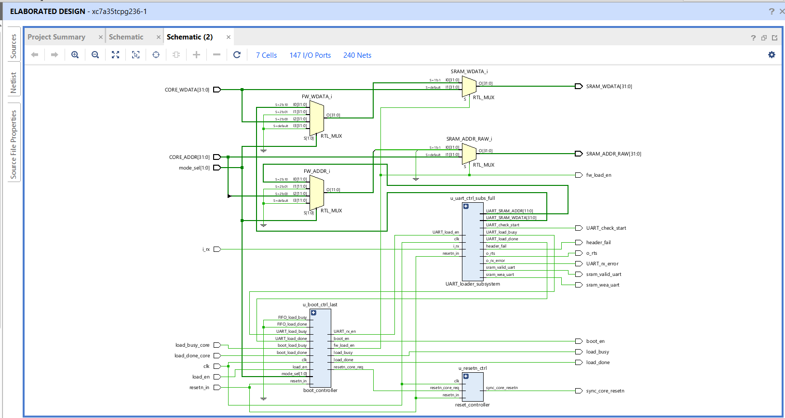

Compared to one with clean wrapper modules:

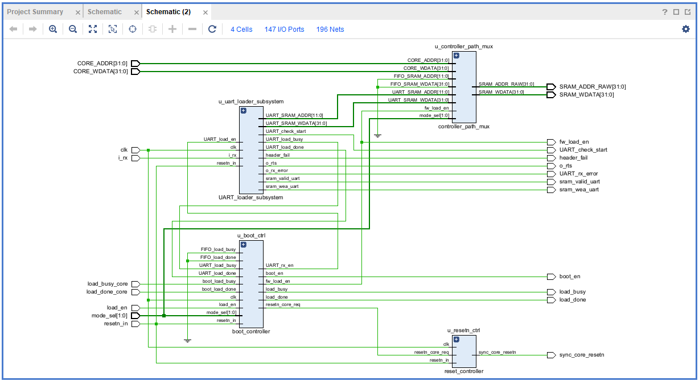

Now right now this may not seem like a big deal, but as the design grows in complexity, not using clean wrapper modules can lead to a very messy and difficult to understand schematic view:

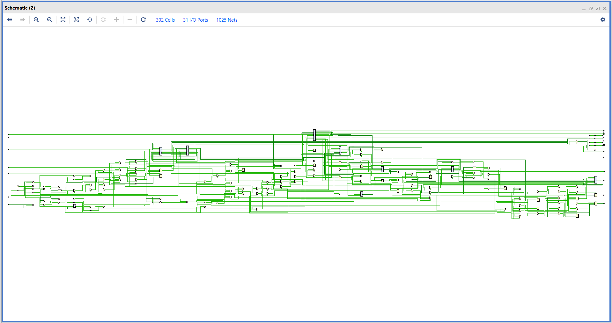

---

## __Comments__:

Comments are good, but there is also a danger of over-commenting. NEVER try to explain HOW your code works in a comment: it's much better to write the code so that the working is obvious, and it's a waste of time to explain badly written code.

Generally, you want your comments to tell WHAT your code does, not HOW. Also, try to avoid putting comments inside a function body: if the function is so complex that you need to separately comment parts of it, you should break the logic down into simpler FSMs. You can make small comments to note or warn about something particularly clever (or ugly), but try to avoid excess. Instead, put the comments at the head of the function, telling people what it does, and possibly WHY it does it.

The preferred style for long (multi-line) comments is:

```verilog
/*
 * This is the preferred style for multi-line
 * comments in the Linux kernel source code.
 * Please use it consistently.
 *
 * Description:  A column of asterisks on the left side,
 * with beginning and ending almost-blank lines.
 */
 ```

This style of commenting is taken inspiration from the __Linux kernel source code__ and is visually distinct and helps to separate the comment block from the code, making it easier to read and understand. It also provides a clear structure for multi-line comments, which can be especially helpful for longer explanations or documentation within the code.

It is also preferred to have single-line comments mainly for *__Input__* and *__Output Ports__* in the module declaration, and for internal `wire` and `reg` declarations related to non-trivial logic in the code.

Again, an important thing to note is to provide these comments only when the signal name itself is not descriptive enough to explain the purpose of the signal.

For example, if we have a signal called `counter`, it is pretty obvious that it is a counter and we do not need to add a comment saying `// This is a counter`.

But for a signal such as `resetn_core_req`, it is not immediately obvious what this signal represents, and thus a comment such as `// Active low reset signal to release core` can be helpful to understand the purpose of the signal.

#### NOTE:

There is a simple quote by __Terry A. Davis__ (Creator of Temple OS) that everyone should keep in mind when writing comments and defining variables/signals -

*"An idiot admires complexity, a genius admires simplicity."*

- Keep the signal names simple and descriptive
- Keep the comments simple and to the point explaining the "what" and "why", NOT the "how".

Here is an example of all the above tips put together in a single code snippet:

```verilog
module boot_controller
(
        //from external
        input wire clk,
        input wire load_en,
        input wire resetn_in,
        input wire [1:0] mode_sel,

        //from UART
        input wire UART_load_done,
        input wire UART_load_busy,

        //from FIFO
        input wire FIFO_load_done,
        input wire FIFO_load_busy,

        //from core
        input wire boot_load_done,
        input wire boot_load_busy,

        //to core
        output reg resetn_core_req,
        output reg boot_en,

        //to SRAM Controller
        output reg fw_load_en,

        // to UART
        output reg UART_rx_en,

        // to FIFO
        output reg FIFO_rx_en,

        // to external
        output reg load_busy,
        output reg load_done
);


...


/*
 * State register and fw_load_done tracking.
 * Keeps a sticky "done" indication until a new load request arrives.
 */
always @ (posedge clk)
begin
        if(!resetn_in)
        begin
                state <= IDLE;
                fw_load_done <=0;
        end
        else
        begin
                if (state == IDLE && load_en)
                        fw_load_done <= 1'b0;
                else
                        fw_load_done <= fw_load_done_next;

        state <= next_state;
        end
end
```

#### Comment titles:

When defining internal `wire` and `reg` for any non-trivial logic, it is preferred to group them together and give a comment title to the group of signals which are either part of the same logic or are used within the same module instance.

The same comment titles should also be used for submodule instantiations to clearly separate multiple submodule instantiations in the wrapper module.

An example of this is shown below:

```verilog
//-------------------------------------//
// parameter definition for FSM States //
//-------------------------------------//
parameter [2:0] IDLE = 3'b000,
                SAMPLE = 3'b001,
                FIFO_LOAD = 3'b010,
                UART_LOAD = 3'b011,
                RST_RELEASE = 3'b100;

//-----------------------//
// internal done signals //
//-----------------------//
reg fw_load_done;
wire fw_load_done_next;
reg load_done_latch;

//-----------------//
// state registers //
//-----------------//
reg [2:0] state, next_state;

//----------------//
// Status Signals //
//----------------//
wire busy_any;
wire done_any;


...


//--------------------------//
// boot_controller instance //
//--------------------------//
boot_controller u_boot_ctrl (
        .clk (clk),
        .resetn_in (resetn_in),
        .load_en (load_en),
        .mode_sel (mode_sel),

        // UART signals
        .UART_load_done (UART_ld_done),
        .UART_load_busy (UART_load_busy),
        .UART_rx_en (UART_rx_enable),

        // FIFO signals
        .FIFO_load_done (FIFO_ld_done),
        .FIFO_load_busy (FIFO_load_busy),
        .FIFO_rx_en (FIFO_rx_en),

        // Boot signals
        .boot_load_done (load_done_core),
        .boot_load_busy (load_busy_core),
        .boot_en (boot_en),

        // Outputs
        .resetn_core_req(resetn_core_req),
        .fw_load_en (fw_load_en),
        .load_done (load_done),
        .load_busy (load_busy)
);
```

This helps to visually separate different groups of signals and makes it easier to understand the purpose of each signal and how they are related to each other. It also improves readability and maintainability of the code, as developers can quickly identify which signals are part of the same logic or module instance.

Here is a template for the comment titles:

```verilog
//----------------------------------//
// <Replace with descriptive title> //
//----------------------------------//
```

## Writing Readable and Predictable Code
Now, with the ground rules, directory structure, file naming conventions, and file structure mentioned above, we can now focus on writing readable and predictable code.

> ### NOTE: __This section is of utmost importance as it directly affects the quality of the generated netlist during synthesis and physical design.__

### 1. __Variable and signal names__:

Variable and signal names should be chosen so that the name itself gives an idea of what the variable/signal represents. For example, `counter` is a better name than `cnt` for a signal that counts something.

In the case of `for` loops, use standard variable names like `i`, `j`, and `k` for loop indices rather than `loop_counter`, but ensure that the loop's purpose is clear from the context.

A signal name should be descriptive enough to explain the purpose of the signal. For example, `resetn_core_req` is a better name than `resetn` for a signal that represents an active low reset signal to release the core.

#### NOTE:

If a signal is pulled from a lower-level module to a higher-level wrapper, it is recommended to keep the EXACT SAME name for the signal in the wrapper module as well. This helps maintain consistency and makes it easier to trace signals through the design when viewing the schematic.

An example of this is shown below for the signal `o_rx_error`:

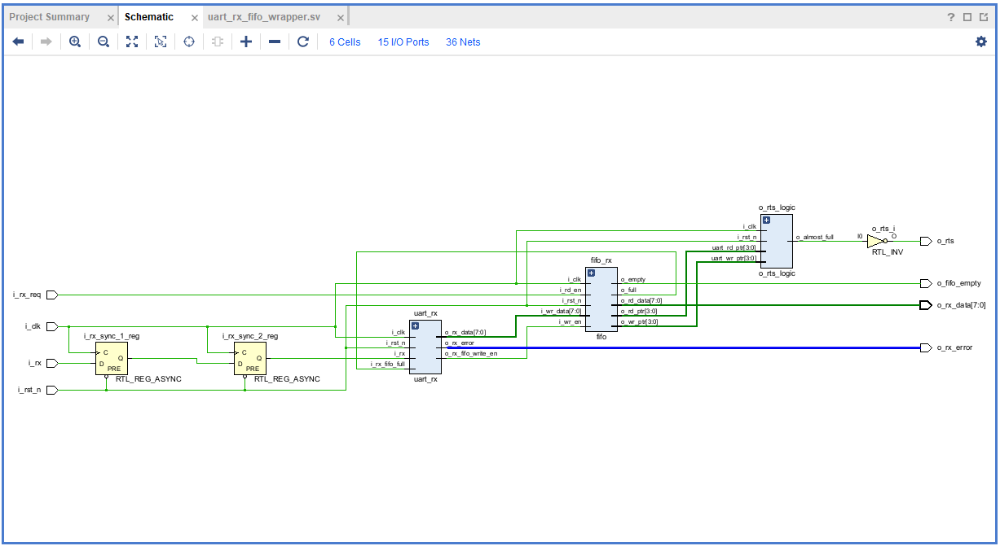

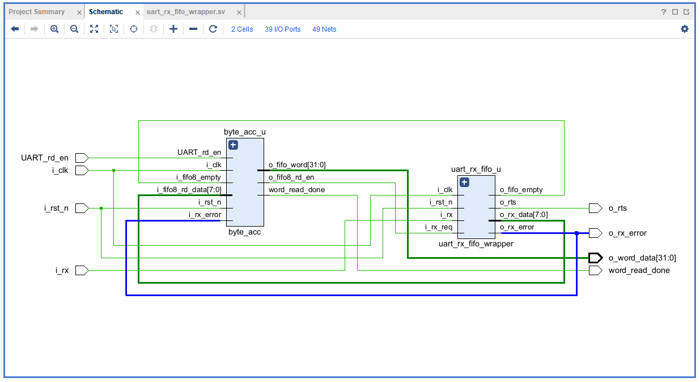

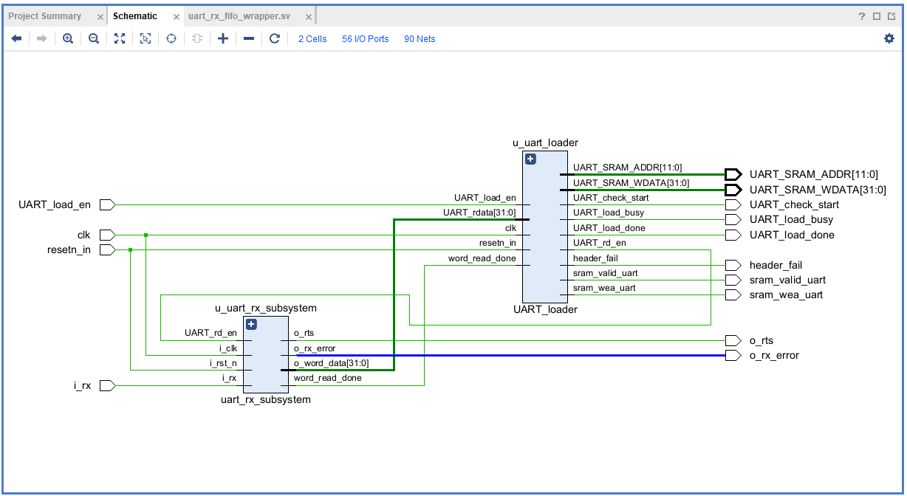

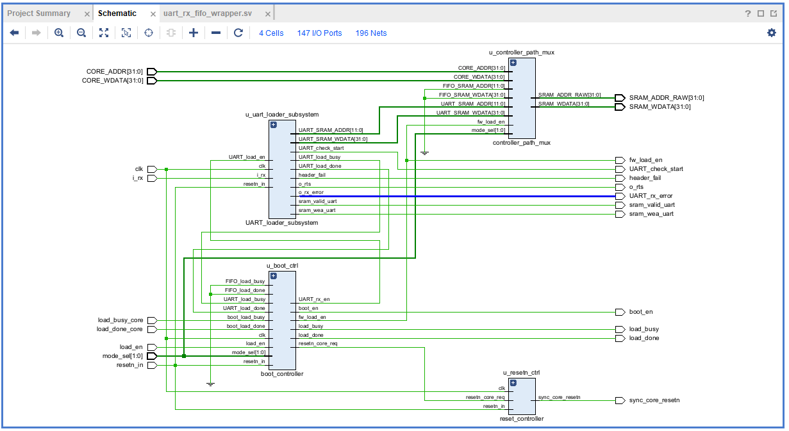

We see that only in the last image the signal name is changed from `o_rx_error` to `UART_rx_error`, as the final top module may also have a signal called `FIFO_rx_error` and changing the name to `UART_rx_error` helps us easily identify which signal comes from which module when viewing the schematic.

### 2. __Maximum Level of Nesting__:

At most, __3 levels__ of nesting is preferred. If you find yourself nesting more than 3 levels and are using Tab size of 8, you will find yourself scrolling to the right to read the code, which is a clear indication that the code is too convoluted and needs to be refactored.

Here is an exmple of a block of code with more than 3 levels of nesting:

```verilog
module packet_router (
        input wire clk,
        input wire rst_n,
        input wire pkt_valid,
        input wire ready,
        input wire secure_mode,
        input wire [1:0] dest_port,
        output reg [2:0] route_status
);

always @(posedge clk)
begin
        if (!rst_n)
                route_status <= 3'b000;
        else
        begin
                // Check if packet is valid
                if (pkt_valid)
                begin
                // Check if downstream channel is ready
                        if (ready)
                        begin
                                // Check if security check passes
                                if (!secure_mode)
                                begin
                                        // Check target destination port
                                        if (dest_port == 2'b01)
                                                // Final leaf assignment
                                                route_status <= 3'b101;
                                        else
                                                route_status <= 3'b100;
                                end
                                else
                                        route_status <= 3'b011;
                        end
                        else
                                route_status <= 3'b010;
                end
                else
                        route_status <= 3'b001;
        end
end

endmodule
```

Notice Something, if these were to be synthesized it generate a series of muxes whose select lines feed into next mux forming a long chain of combinational logic.

This has 3 issues:
1) Any change required to the logic will require refactoring the entire block of code.
2) Missing even a single `begin` `end` clause or `else` statement will synthesize to __X__ logic in edge cases.
3) Due to the long chain formed by muxes, chances of setup and hold violations are very high, which can lead to timing failures in the design.

In the above code I have also put alot of unnecessary comments to explain the logic, which is not needed if the code is written in a more readable way.

Here is a better way to write the same logic with 3 or less levels of nesting:

```verilog
module packet_router (
        input wire clk,
        input wire rst_n,
        input wire pkt_valid,
        input wire ready,
        input wire secure_mode,
        input wire [1:0] dest_port,
        output reg [2:0] route_status
);

always @(posedge clk or negedge rst_n)
begin
        if (!rst_n)
                route_status <= 3'b000;
        else
        begin
                if (!pkt_valid)
                        route_status <= 3'b001;
                else if (!ready)
                        route_status <= 3'b010;
                else if (secure_mode)
                        route_status <= 3'b011;
                else
                begin
                        case (dest_port)
                                    2'b01:
                                        route_status <= 3'b101;
                                    default:
                                        route_status <= 3'b100;
                        endcase
                end
        end
end

endmodule
```

We can completely flatten this logic by using logical operators (&&) to combine early-exit conditions and utilizing a clean case structure for the destination checking.

Some of the key benefits of this approach are:
1) __Early Exits:__ Handling error/idle states (!pkt_valid, !ready) immediately eliminates the need to nest subsequent operations inside them.
2) __Case Statement Transformation:__ Replacing the lowest level of nested if-else blocks with a case statement removes indentation levels and guides the synthesis tool to create cleaner parallel logic instead of chain of muxes.
3) __Readability:__ A developer can scan down the else if conditions linearly rather than tracking matching pairs across multiple indentation depths.

### 3. Latch Avoidance in Combinational Logic:
Latches are the absolute enemy of standard ASIC synthesis. They create timing loops, complicate Static Timing Analysis (STA), and waste physical area.

Latches occur when an `if/elseif` tree is not closed by a final `else` statement, or when a `case` statement does not cover all cases (full case) or does not have a `default` case.

Latches should ALMOST always be avoided unless absolutely necessary (in which case they should be __clearly documented__).

__Best Practice:__ Assign a default value to all outputs at the very top of your combinational block. This guarantees Genus will synthesize pure combinational logic (AND/OR/XOR gates) rather than sequential D-Latches.

Bad Code:
```verilog
always @(*)
begin
        if (enable)
                data_out = data_in;
end
```
Here, if `enable` is low, `data_out` retains its previous value, which infers a latch.

```verilog
always @(*)
begin
        data_out = 1'b0;
        if (enable)
                data_out = data_in;
end
```
This logic synthesies into an *AND gate* with `enable` as one input and `data_in` as the other.

### 4. Mux Inference vs. Priority Encoders (if-else vs case)
The way you structure conditional logic dictates whether Genus builds a deep logic chain or a fast, flat multiplexer.

- Use case statements instead of long if-else chains where appropriate.

- Multiple if statements with multiple branches result in the creation of priority encoder structure. (Chain of muxes where the first true condition takes precedence over the others.)

- An "if else if" infers priority encoder.

- A general case statement infers a n-way multiplexer. which is a faster circuit with less logic depth.

- Use late arriving signal early in an 'if-else' loop to keep these late arriving signals with critical timing closest to the output of a logic block.

### 5. __Clock and Reset__:
Clocks and resets are treated as specialised signals when considering ASIC Synthesis as almost every module unanimously uses it to synchronise the logic to a known state. Thus, it is important to follow a few rules when dealing with clock and reset signals.

#### Sensitivity List:
- Sensitivity list sets the stage of how you treat these signals in your design.
- Whenever there is a `posedge` or `negedge` construct synthesis tool infers a flip flop.

#### General Rule of Thumb:
1) Clock signals are __Active High__ and are always used in `posedge` constructs.

```verilog
always @(posedge clk)
begin

---

end
```

2) Prefer __Active Low__ Synchronous Reset signals in design.

```verilog
always @(posedge clk)
begin
        if (!resetn)

                ---

        else

                ---

end
```

> Reset Signals in almost ALL ASIC designs are taken as __Active Low__ signals. The specific reason comes down to the physics behind __NAND__ and __NOR__ gates.
> - __NAND__ gates, by design are smaller and faster than __NOR__ gates.
> - They use __N-channel transistors__ in series to pull the output to ground. Because *electrons* move faster than *holes* (used in __PMOS__), __NMOS__ transistors are highly efficient.
> - With being smaller and faster the overall area and clock to Q delay is reduced in the design, leading to smaller propagation delays and better timing closure (especially in high frequency designs where reset is crucial to set the design in a known state).

### 6. __Dealing with long lines__:

Coding style is all about readability and maintainability using commonly available tools.

The preferred limit on the length of a single line is 80 columns.

Statements longer than 80 columns should be broken into sensible chunks, unless exceeding 80 columns significantly increases readability and does not hide information.

For long assign statements, the preferred style is:

```verilog
assign long_signal_name = signal_a & signal_b &
                                                    signal_c & signal_d &
                                                    signal_e & signal_f;
```

This style allows for clear separation of the different signals being ANDed together, making it easier to read and understand the logic.

### 7. __Brackets__:

Brackets `()` are mainly encountered in module definitions and submodule instantiations in Verilog code.

In general, for module definitions, keep the braces on separate lines for both parameter list and port list, and align the port names and parameter names vertically for better readability. For example:

```verilog
module SRAM_controller
#(
        parameter N = 12,
        parameter W = 32
)(
        //from external
        input clk,
        input resetn_in,
        input load_en,
        input i_rx,
        input [1:0] mode_sel,

        //from Core
        input wire load_busy_core,
        input wire load_done_core,
        input wire [W-1:0] CORE_WDATA,
        input wire [31:0] CORE_ADDR,

        //to Core
        output wire sync_core_resetn,
        output wire boot_en,

        //to address decoder
        output wire [31:0] SRAM_ADDR_RAW,
        output wire fw_load_en,

        //to SRAM
        output wire [31:0] SRAM_WDATA,

        //to external
        output load_busy,
        output load_done,
        output o_rts,
        output UART_check_start,
        output UART_rx_error,
        output header_fail,

        // to BRAM IP
        output sram_valid_uart,
        output sram_wea_uart
);
```

For submodule instantiations, however, the preferred style is to keep the opening bracket on the same line as the module name and align the port connections vertically for better readability.

```verilog
//-------------------------------//
// controller_path_mux instance  //
//-------------------------------//
controller_path_mux #(
        .N (N),
        .W (W)
) u_controller_path_mux (
        .mode_sel (mode_sel),
        .fw_load_en (fw_load_en),
        .CORE_WDATA (CORE_WDATA),
        .CORE_ADDR (CORE_ADDR),
        .UART_SRAM_WDATA (UART_SRAM_WDATA),
        .UART_SRAM_ADDR (UART_SRAM_ADDR),
        .FIFO_SRAM_WDATA (FIFO_SRAM_WDATA),
        .FIFO_SRAM_ADDR (FIFO_SRAM_ADDR),
        .FW_ADDR (FW_ADDR),
        .FW_WDATA (FW_WDATA),
        .SRAM_ADDR_RAW (SRAM_ADDR_RAW),
        .SRAM_WDATA (SRAM_WDATA)
);
```

#### NOTE:
> When calling the submodule use `u_` as prefix for the instance name to clearly indicate that it is a module instance. For example, `u_controller_path_mux` for an instance of the `controller_path_mux` module. This is a common convention in Verilog coding style and helps to easily identify module instances in the code.

### 8. __`begin` and `end` placement for `if-else` and `case` statements__:

There are different ways people prefer to place `begin` and `end` statements for `if-else` and `case` statements.

Some prefer to place the `begin` statement on the same line as the `if` or `else` keyword.

For starters, any `if-else` or `case` statement with ONLY ONE statement in its body should NOT have `begin` and `end` statements, as this is redundant and adds unnecessary lines to the code (although it may be slightly more readable).

```verilog
if (condition)
        statement;
else
        statement;
```
For `if-else` and `case` statements with MORE THAN ONE statement in the body, it is preferred to have `begin` and `end` at the same indentation level.

This easily helps to visually separate the different blocks of code and makes it easier to understand the structure of the code.

```verilog
/*
 * State register and fw_load_done tracking.
 * Keeps a sticky "done" indication until a new load request arrives.
 */
always @ (posedge clk)
begin
        if(!resetn_in)
        begin
                state <= IDLE;
                fw_load_done <=0;
        end
        else
        begin
                if (state == IDLE && load_en)
                        fw_load_done <= 1'b0;
                else
                        fw_load_done <= fw_load_done_next;

                state <= next_state;
        end
end
```

Here is an example with case statement:

```verilog
always @ (posedge clk)
begin
        if(!resetn_in)
        begin
                resetn_core_req <= 0;
                fw_load_en <= 0;
                boot_en <= 0;
                UART_rx_en <= 0;
                FIFO_rx_en <= 0;
        end
        else
        begin
                case(state)
                        IDLE:
                        begin
                                resetn_core_req <= 0;
                                if(load_en & !fw_load_done)
                                        fw_load_en <= 1;
                        end

                        SAMPLE:
                        begin
                                if(mode_sel == 2'b00)
                                        boot_en <= 1;
                                else
                                        boot_en <=0;
                        end

                        FIFO_LOAD:
                        begin
                                FIFO_rx_en <= 1;

                                if(fw_load_done_next)
                                        fw_load_en <= 0;
                        end

                        UART_LOAD:
                        begin
                                UART_rx_en <= 1;
                                if(fw_load_done_next)
                                        fw_load_en <= 0;
                        end

                        RST_RELEASE:
                        begin
                                resetn_core_req <= 1;
                                if (fw_load_done)
                                begin
                                        boot_en <= 0;
                                            FIFO_rx_en <= 0;
                                            UART_rx_en <= 0;
                                end
                        end

                        default:
                        begin
                                resetn_core_req <= 0;
                                fw_load_en <= 0;
                                boot_en <= 0;
                                UART_rx_en <= 0;
                                FIFO_rx_en <= 0;
                        end
                endcase
        end
end
```

### 9. __Avoid assigning logic directly to wire when defining them__:

It is preferred to avoid assigning logic directly to `wire` when defining them.

As in a project if a few signals are assigned value using assign statements and a few signals are assigned value directly in the `wire` definition, you have to continuosly scroll up and down to check which signals are defined using assign statements and which are defined using direct assignment in the `wire` definition, which can be a bit annoying and can also lead to missing some signals.

Avoid:
```verilog
wire signal_a = signal_b & signal_c;
```
Preferred:
```verilog
wire signal_a;


...


assign signal_a = signal_b & signal_c;
```

### 10. __Prefer Reusable Logic (`define and parameters)__:
In a large design with multiple modules, signals will often communicate between modules.

Any change required to such signals will require manually keeping track of all the modules where the signal is used and changing it in all those modules.

#### Parameters:
Parameters are a great way to define bus widths, state values, and other constants that may need to be changed in the future.

1) __Child Modules__ define default local parameters for their I/O port widths and internal signals.

2) The __Parent/Wrapper Module__ defines its own parameter list.

3) __Submodule Instantiations__ explicitly override the child parameters by passing the wrapper's parameter down using the __#(.PARAM_NAME(WRAPPER_PARAM))__ syntax.

Consider this example below of 2 different child modules with different default parameters for their I/O port widths and internal signals:

```verilog
`timescale 1ns / 1ps

module bus_adder
#(
        parameter DATA_WIDTH = 16
)(
        input  [DATA_WIDTH-1:0] a,
        input  [DATA_WIDTH-1:0] b,
        output [DATA_WIDTH-1:0] sum
);

        assign sum = a + b;

endmodule
```


```verilog
`timescale 1ns / 1ps

module bus_register
#(
        parameter DATA_WIDTH = 16
)(
        input                         clk,
        input                         resetn,
        input                         load_en,
        input      [DATA_WIDTH-1:0]   d_in,
        output reg [DATA_WIDTH-1:0]   d_out
);

        always @(posedge clk)
        begin
                if (!resetn)
                        d_out <= {DATA_WIDTH{1'b0}};
                else
                begin
                        if (load_en)
                                d_out <= d_in;
                end
        end

endmodule
```

The parent/wrapper module can then define its own parameter list and override the child parameters as needed:

```verilog
`timescale 1ns / 1ps

module data_path_wrapper
#(
        parameter DATA_WIDTH = 32
)(
        input                         clk,
        input                         resetn,
        input                         load_en,
        input      [DATA_WIDTH-1:0]   operand_a,
        input      [DATA_WIDTH-1:0]   operand_b,
        output     [DATA_WIDTH-1:0]   result_out
);

wire [DATA_WIDTH-1:0] sum_internal;

bus_adder #(
        .DATA_WIDTH (DATA_WIDTH)
) u_bus_adder (
        .a          (operand_a),
        .b          (operand_b),
        .sum        (sum_internal)
);

bus_register #(
        .DATA_WIDTH (DATA_WIDTH)
) u_bus_register (
        .clk        (clk),
        .resetn     (resetn),
        .load_en    (load_en),
        .d_in       (sum_internal),
        .d_out      (result_out)
);

endmodule
```

If an even higher-level module or testbench needs to change the bus width (e.g., from 32-bit to 64-bit), it simply passes the new value into data_path_wrapper without touching any source code in the underlying submodules:

```verilog
data_path_wrapper #(
        .DATA_WIDTH (64)
) u_data_path_wrapper_64bit (
        .clk        (clk),
        .resetn     (resetn),
        .load_en    (load_en),
        .operand_a  (operand_a_64),
        .operand_b  (operand_b_64),
        .result_out (result_out_64)
);
```

#### define  and ifdef Statements:

__define__ statements are a great way to create global text-substitutions for constants, macros, or other reusable code snippets.

__ifdef__ statements are useful for isolating code blocks for conditional compilation, allowing you to include or exclude certain parts of the code based on defined macros.

__define__ directives exist in the global compilation scope. It is standard practice to place build-wide macros in a dedicated header file.

```verilog
`timescale 1ns / 1ps

// Target Target Switch:
// Define TARGET_SIMULATION for fast behavioral simulation.
// Comment it out during Cadence Genus ASIC synthesis.
`define TARGET_SIMULATION

// Memory IP Selection:
// Uncomment to swap out behavioral memory with foundry Hard-IP macros.
// `define USE_FOUNDRY_SRAM_IP

// Optional Feature Flags:
// Enables additional hardware checking logic in the pipeline.
`define FEATURE_PARITY_CHECK
```

Here is how this can be used in a memory controller module to demonstrate the use of __define__ and __ifdef__ statements:

```verilog
`timescale 1ns / 1ps
///////////////////////////////////////////////////////////////////////////////////////////////////////////////////////////
// Engineer: Samyak Nidhi
// Last Modified: 04.08.2026
// Module Name: memory_controller
// Project Name: Silicon SoC kNN
// Description: Memory controller demonstrating `define macro usage and `ifdef conditional compilation blocks.
///////////////////////////////////////////////////////////////////////////////////////////////////////////////////////////

`include "config.vh"

module memory_controller
#(
        parameter ADDR_WIDTH = 8,
        parameter DATA_WIDTH = 32
)(
        input                         clk,
        input                         resetn,
        input                         mem_en,
        input      [ADDR_WIDTH-1:0]   addr,
        input      [DATA_WIDTH-1:0]   wdata,
        output reg [DATA_WIDTH-1:0]   rdata,
        output reg                    parity_err
);

`ifdef USE_FOUNDRY_SRAM_IP
        // Instantiating TSMC/GF Vendor Hard-IP Cell for ASIC Tapeout
        sram_256x32_macro u_asic_sram (
                .CLK   (clk),
                .CEN   (~mem_en),
                .A     (addr),
                .D     (wdata),
                .Q     (rdata)
        );
`else
        // Generic Behavioral Memory Model (Used for fast simulation prototyping)
        reg [DATA_WIDTH-1:0] ram_matrix [0:(1<<ADDR_WIDTH)-1];

        always @(posedge clk)
        begin
                if (mem_en)
                begin
                        ram_matrix[addr] <= wdata;
                        rdata            <= ram_matrix[addr];
                end
        end
`endif

`ifdef FEATURE_PARITY_CHECK
        // Parity check circuit is synthesized ONLY when FEATURE_PARITY_CHECK is defined
        always @(posedge clk)
        begin
                if (!resetn)
                        parity_err <= 1'b0;
                else
                begin
                        if (mem_en)
                                parity_err <= ^rdata; // Even parity calculation
                end
        end
`else
        always @(*)
        begin
                parity_err = 1'b0;
        end
`endif

`ifdef TARGET_SIMULATION
        // Display statements only exist in simulation and are compiled out for Genus
        always @(posedge clk)
        begin
                if (mem_en && (addr >= (1<<ADDR_WIDTH)))
                        $display("[WARN %0t] Memory access out of bounds! Address: 0x%h", $time, addr);
        end
`endif

endmodule
```

> #### ⚠️ Crucial Guidelines for ASIC Synthesis (Cadence Genus)

>__Scope Warning:__ __define__ macros are global. If you define __define DATA_WIDTH 32__ in *File A*, it can silently overwrite definitions in *File B* if compiled in the same session.

>__Rule:__ Use __parameter__ or __localparam__ for module-level constants (bus widths, state machines). Reserve __define__ strictly for global build flags, target selection, or include files.

>__Header Protection:__ Always wrap configuration headers in macro guards (similar to C/C++ #ifndef) to prevent duplicate definition warnings across multiple files:

```verilog
`ifndef CONFIG_VH
`define CONFIG_VH

// Macro definitions go here...

`endif // CONFIG_VH
```

---

## FSM Coding
This section could alone be a separate document as any large design will have multiple FSMs cross-talking with each other.

When designing Finite State Machines (FSMs), the preferred standard is the __3-Always Block (3-segment)__ coding style. This methodology explicitly separates the state memory, the next-state logic, and the output logic into three distinct blocks. This is a widely accepted and practiced __Industry standard__ for FSM design.

This separation prevents synthesis tools from inferring unwanted latches, makes debugging much easier in simulation, and allows the synthesis tool to easily identify and optimize the FSM structure.

## 1. The Structure of a 3-Segment FSM

1) __Segment 1:__ State Memory __(Sequential)__ - A clocked block that updates the current_state with the next_state on the clock edge, and handles asynchronous/synchronous resets.

2) __Segment 2:__ Next-State Logic __(Combinational)__ - A purely combinational block __always @(*)__ that evaluates the current_state and inputs to determine the next_state.

3) __Segment 3:__ Output Logic __(Sequential)__ - A block that determines the module's outputs based on the current_state __(Moore)__ or current_state and inputs __(Mealy)__. For ASIC designs, registered outputs __(sequential)__ are highly preferred to prevent combinational glitches from propagating through the design.

## 2. General FSM Layout Rules

1) __State Encoding:__ Always use `parameter` (or `localparam`) to define state names. Do not use hardcoded magic numbers in your logic blocks.

2) __Variable Naming:__ Clearly define your state registers as `state` and `next_state`.

4) __Default Assignments (Latch Avoidance):__ In the combinational next-state block, explicitly assign `next_state = state;` at the very top. This prevents the tool from inferring a latch if a specific conditional branch is missed.

## 3. Handling Datapath Logic within Sequential FSMs

When writing FSMs or general sequential logic, you will inevitably need to update datapath variables (like counters, addresses, or data payload). A strict distinction must be made between simple control arithmetic and complex datapath arithmetic.

### The Rule:

- __Simple Logic:__ Small, standard combinational logic such as incrementing or decrementing a counter `counter <= counter + 1'b1;` or setting a flag `flag <= 1'b1;` is perfectly acceptable directly inside the sequential `always @(posedge clk)` block. Synthesis tools easily infer these as standard incrementers/decrementers.

- __Complex Logic:__ Large combinational logic such as chained arithmetic, multiplication, shifting, or deep address calculations should NEVER be computed directly inside the clocked block. Instead, calculate the result in a continuous assign statement or a separate always @(*) block using a `next_<signal_name> wire/reg`, and simply register that next_ signal inside the sequential block.

### Rationale:

1) __Datapath Optimization:__ Synthesis tools excel at *datapath extraction.* By isolating complex math in a pure combinational block, Genus can more easily restructure the math (e.g., merging adders, swapping multipliers) to meet aggressive timing and area constraints.

2) __Resource Sharing:__ If a complex calculation is needed across multiple FSM states, computing it once in an assign statement allows the FSM to just route the result, rather than the synthesis tool accidentally instantiating redundant adders for every state.

3) __Readability and STA:__ Isolating the datapath makes it trivial to identify the longest timing paths in *Static Timing Analysis (STA)* and keeps the FSM control block clean and easy to read.

### Code Example:

```verilog
//------------------------------------------------//
// Intermediate Signals for Datapath Computations //
//------------------------------------------------//
wire [31:0] next_address;

always @(posedge clk)
begin
        if (!resetn_in)
        begin
                counter <= 8'b0;
                address <= 32'b0;
        end
        else
        begin
                case (state)
                        IDLE:
                                counter <= 8'b0;

                        COMPUTE:
                        begin
                                counter <= counter + 1'b1;
                                address <= next_address;
                        end

                        default:
                        begin
                                counter <= counter;
                                address <= address;
                        end
                endcase
        end
end

/*
 * offset is word-aligned and base_addr is byte-aligned, so
 * we need to multiply offset by 4 (<<2) before adding it to
 * base_addr. Final result is converted back to word-aligned
 * address.
 */
assign next_address = (base_addr + (offset << 2)) >> 2;
```

## 4. Managing FSM Complexity and State Limits
To maintain highly readable, easily verifiable, and timing-clean logic, FSMs must not become bloated spider webs, where every state is interconnected. Large FSMs with dozens of states create massive cyclomatic complexity, making simulation debugging a nightmare and often leading to deeply nested logic that fails synthesis timing constraints.

### The Rule:
- __Maximum State Limit:__ An individual FSM should not exceed a total of __5 states__.
- __Linear Code Progression:__ When writing your case(state) block, list the states in a linear, logical order of execution (e.g., `IDLE` $\rightarrow$ `START` $\rightarrow$ `COMPUTE` $\rightarrow$ `DONE`). Avoid scattering states randomly throughout the block. Even if the FSM loops or branches, the visual layout in the code should follow the primary *happy path* of the data flow.
- __FSM Partitioning:__ If your control logic inherently requires more than 5 states, you must break the FSM into multiple, smaller communicating FSMs (often referred to as __Hierarchical FSMs__ or __interacting state machines__).

### Rationale:

- __Readability:__ A 5-state limit guarantees that the entire next-state logic block can easily fit on a single monitor screen, eliminating the need to scroll up and down to understand the control flow.
- __Timing & Area:__ Synthesis tools optimize small FSMs highly effectively. When an FSM grows too large, the tool struggles to assign optimal state encodings, resulting in bloated area and poor setup timing on the state registers.
- __Linear Tracing:__ Keeping the states in sequential order in your Verilog file allows another engineer to read the code top-to-bottom like a story, rather than jumping around non-linearly to figure out where the state machine goes next.

## 5. Communication Between FSMs and Default Case
Signals used to communicate between different FSMs (cross-talk) should be implemented as __single-cycle pulses__. To automatically generate a clean pulse without complex state-tracking, assign the signal to its inactive state (e.g., 0) immediately after the synchronous `else` statement and before the `case` statement.

Signals that do not need to be pulses (i.e., level signals that hold their value across multiple clock cycles) should not be assigned before the `case` statement. Instead, to prevent latching unwanted values during illegal states, explicitly assign these signals to a known, safe value inside the `default` clause of the case statement.

Code Example:

```verilog
always @(posedge clk)
begin
        if (!resetn)
        begin
                state       <= IDLE;
                fsm_pulse   <= 1'b0;
                fsm_level   <= 1'b0;
        end
        else
        begin
                fsm_pulse <= 1'b0; // Pulse Signal

                case (state)
                        IDLE:
                        begin
                                if (trigger)
                                begin
                                        state <= ACTIVE;
                                        fsm_pulse <= 1'b1;
                                        fsm_level <= 1'b1;
                                end
                        end

                        ACTIVE:
                        begin
                                if (done)
                                begin
                                        state <= IDLE;
                                        fsm_level <= 1'b0;
                                end
                        end

                        default:
                        begin
                                state <= IDLE;
                                fsm_level <= 1'b0; // Non pulse signal, assigned to safe value in default case
                        end
                endcase
        end
end
```

## 6. Positive if Conditions (Happy Path)

Drawing inspiration from the Linux Kernel Coding Style, conditional logic should always prioritize the primary active state ("happy path") using positive logic.

Inverting condition checks or nesting the main logic deep within an else branch increases cognitive overhead, makes RTL hard to trace during hardware debugging, and raises the likelihood of inverted-logic bugs.

### The Rule:
1) __Use Positive Logic First:__ Always structure your primary conditional evaluation around positive assertions e.g., `if (valid)` or `if (enable)` rather than negative assertions e.g., `if (!invalid)` or `if (!disabled)`.

2) __Prioritize the Happy Path:__ Place the primary operational logic directly inside the main `if` block, leaving error handling, stalls, or idle states for the `else` branch or default assignments.

3) __Avoid Inverted Signal Naming:__ Do not use double negatives in code e.g., `if (!not_ready)`. The only standard exception to positive logic is __active-low__ hardware control signals (such as `resetn`).

### Rationale:
1) __Reduced Cognitive Load:__ Human brains process positive logic far faster than double negatives. Inverted conditions force anyone reading the code to mentally negate signals at every branch.

2) __Traceability in Waveforms:__ When debugging gate-level or RTL simulations, following a positive *happy path* makes it significantly easier to trace active high flags (`valid`, `ready`, `enable`) directly against state transitions.

3) __Synthesis Integrity:__ While tools like Cadence Genus optimize and collapse inverted gates ($NOT \rightarrow NAND/NOR$) seamlessly during synthesis, structuring logic around positive conditions ensures the design intent is clear, preventing accidental latch inference or unexpected multiplexer priorities.

### Bade Code Example:

```verilog
always @(posedge clk)
begin
        if (!resetn)
        begin
                tx_start <= 1'b0;
                tx_data  <= 8'h00;
        end
        else
        begin
                if (!rx_valid)
                        tx_start <= 1'b0;
                else
                begin
                        if (!fifo_full)
                        begin
                                tx_start <= 1'b1;
                                tx_data  <= rx_data;
                        end
                        else
                                tx_start <= 1'b0;
                end
        end
end
```

### Good Code Example:

```verilog
always @(posedge clk)
begin
        if (!resetn)
        begin
                tx_start <= 1'b0;
                tx_data  <= 8'h00;
        end
        else
        begin
                tx_start <= 1'b0;
                if (rx_valid && !fifo_full)
                begin
                        tx_start <= 1'b1;
                        tx_data  <= rx_data;
                end
        end
end
```

Here, by interntionally asserting that `tx_start` value must ONLY change when `rx_valid` is __high__ and `fifo_full` is __low__, we have reduced the number of nested if-else statements and made the code more readable.


## Putting it all together

```verilog
`timescale 1ns / 1ps
///////////////////////////////////////////////////////////////////////////////////////////////////////////////////////////
// Engineer: Samyak Nidhi
// Last Modified: 04.08.2026
// Module Name: fsm_data_processor
// Project Name: Silicon SoC kNN
// Description:
// 3-Segment, 5-state FSM controller for memory address processing.
// Demonstrates ASIC synthesis rules including datapath separation, pulse/level
// signal cross-talk generation, positive logic evaluation, and latch avoidance.
///////////////////////////////////////////////////////////////////////////////////////////////////////////////////////////

module fsm_data_processor
#(
        parameter ADDR_WIDTH   = 32,
        parameter OFFSET_WIDTH = 16
)(
        input clk,
        input resetn,
        input start_req,
        input data_valid,
        input error_flag,
        input [ADDR_WIDTH-1:0] base_addr,
        input [OFFSET_WIDTH-1:0] offset,

        output reg busy,
        output reg done_pulse,
        output reg error_pulse,
        output reg [ADDR_WIDTH-1:0] out_addr,
        output reg [7:0] process_count
);

//-------------------------------------//
// Parameter definition for FSM States //
//-------------------------------------//
parameter [2:0] IDLE    = 3'b000,
                INIT    = 3'b001,
                PROCESS = 3'b010,
                DONE    = 3'b011,
                FAULT   = 3'b100;

//---------------//
// State signals //
//---------------//
reg [2:0] state, next_state;


wire [ADDR_WIDTH-1:0] next_calculated_addr;

//----------------------------//
// FSM State Transition Logic //
//----------------------------//
always @(posedge clk)
begin
        if (!resetn)
                state <= IDLE;
        else
                state <= next_state;
end

//------------------//
// State Operations //
//------------------//
always @(posedge clk)
begin
        if (!resetn)
        begin
                busy          <= 1'b0;
                done_pulse    <= 1'b0;
                error_pulse   <= 1'b0;
                out_addr      <= {ADDR_WIDTH{1'b0}};
                process_count <= 8'd0;
        end
        else
        begin
                done_pulse  <= 1'b0;
                error_pulse <= 1'b0;

                case (next_state)
                        IDLE:
                        begin
                                busy          <= 1'b0;
                                process_count <= 8'd0;
                        end

                        INIT:
                        begin
                                busy <= 1'b1;
                                out_addr <= next_calculated_addr;
                        end

                        PROCESS:
                        begin
                                busy <= 1'b1;
                                process_count <= process_count + 1'b1;
                        end

                        DONE:
                        begin
                                busy       <= 1'b0;
                                done_pulse <= 1'b1;
                        end

                        FAULT:
                        begin
                                busy        <= 1'b0;
                                error_pulse <= 1'b1;
                        end

                        default:
                        begin
                                busy          <= 1'b0;
                                process_count <= 8'd0;
                                out_addr      <= {ADDR_WIDTH{1'b0}};
                        end
                endcase
        end
end

//--------------------------------//
// Next-State Combinational Logic //
//--------------------------------//
always @(*)
begin
        next_state = state; // Default assignment to prevent latches

        case (state)
                IDLE:
                begin
                        if (start_req)
                                next_state = INIT;
                        else
                                next_state = IDLE;
                end

                INIT:
                begin
                        if (error_flag)
                                next_state = FAULT;
                        else if (data_valid)
                                next_state = PROCESS;
                        else
                                next_state = INIT;
                end

                PROCESS:
                begin
                        if (error_flag)
                                next_state = FAULT;
                        else if (process_count == 8'd10)
                                next_state = DONE;
                        else
                                next_state = PROCESS;
                end

                DONE:
                        next_state = IDLE;

                FAULT:
                begin
                        if (start_req)
                                next_state = IDLE;
                        else
                                next_state = FAULT;
                end

                default:
                        next_state = IDLE;
        endcase
end

/*
 * offset is word-aligned and base_addr is byte-aligned, so
 * we need to multiply offset by 4 (<<2) before adding it to
 * base_addr. Final result is converted back to word-aligned
 * address.
 */
assign next_calculated_addr = (base_addr + (offset << 2)) >> 2;

endmodule
```

As seen in above code:
- Next-State Combinational logic has all `if` conditions in positive logic and the happy path is prioritized and closed with `else` statements to avoid latches.

- Comments only explain intent and purpose of the code, NOT how the logic works for `next_calculated_addr`.

- `data_pulse` and `error_pulse` are single-cycle pulse signals generated by assigning them to 0 at the start of the sequential block, and only asserting them high in the specific states where they are needed. These signals can be used to communicate between FSMs without the risk of latching unwanted values.

## Testbenches

Testbenches, in general, do not have coding style rules as strict as design files, as most developers writing testbenches focus on functionality and breaking the design through corner cases rather than readability and maintainability.

Thus, following the ground rules, directory structure, and file naming conventions mentioned above is sufficient for writing testbenches.

The only additional tip for testbenches is to use the comment header to provide a detailed description of all test cases being performed and verified, in order. This helps other developers quickly understand the purpose of the testbench and the different scenarios being tested without having to read through the entire code.

Here is an example of a testbench comment header with detailed description of the test cases taken from the testbench `tb_SRAM_Controller_full.sv`:

```verilog
`timescale 1ns / 1ps
///////////////////////////////////////////////////////////////////////////////////////////////////
// Engineer: Shashank Tiwari, Samyak Nidhi
// Update Date: 27.03.2026
// Module Name: tb_SRAM_Controller_full
// Project Name: Silicon SoC kNN
// Description:
// Testbench for verifying addr_decoder integration within SRAM_controller.
// Test order:
// (1) Master reset w/ decoder disabled → confirm `fw_load_en`, `boot_en`, `load_busy`
//     remain low and `decoded_SRAM_ADDR` floats for CORE_ADDR = 0x000/0x900.
// (2) UART load smoke → enable mode_sel=2'b10, assert load_en, wait for fw_load_en,
//     transmit CTS/RTS header 0xA5D5 + 10 data words while CORE side is stuck at
//     CORE_ADDR=0x999 / CORE_WDATA=0x9999_9999. After each word ensure SRAM_WDATA
//     differs from core data, then wait for load_done and drop load_en.
// (3) UART bad header check → re-run load, issue malformed header, expect header_fail to latch.
// (4) Post-UART idle check → after fw_load_en drops, re-run loader inactivity task to
//     verify all loader/control outputs return low.
// (5) Core write sweep → set core_decoder_en=1 and march CORE_ADDR from 0x800 upward
//     (10 entries spaced by 4). For each address, expect SRAM_WDATA to mirror CORE_WDATA
//     and decoded address to equal CORE_ADDR[N+1:2], holding each stimulus for 5,000 cycles.
// (6) Summary + watchdog → print pass/fail totals; an independent 500 ms watchdog ensures
//     the bench terminates if anything stalls.
// Throughout: scoreboard counters plus SV assertions monitor loader gating, path ownership,
// address translation, and reset behavior continuously.
///////////////////////////////////////////////////////////////////////////////////////////////////
```

### UUT in Testbench

When instantiating the Unit Under Test (UUT) in the testbench, follow the same principle done for module. Keep the indentation of signal connections at the same level and align the port connections vertically for better readability.

```verilog
SRAM_controller #(
        .N (N),
        .W (W)
) dut (
        .clk (clk),
        .resetn_in (resetn_in),
        .load_en (load_en),
        .i_rx (i_rx),
        .mode_sel (mode_sel),
        .load_busy_core (load_busy_core),
        .load_done_core (load_done_core),
        .CORE_WDATA (CORE_WDATA),
        .CORE_ADDR (CORE_ADDR),
        .sync_core_resetn (sync_core_resetn),
        .boot_en (boot_en),
        .SRAM_ADDR_RAW (SRAM_ADDR_RAW),
        .fw_load_en (fw_load_en),
        .SRAM_WDATA (SRAM_WDATA),
        .load_busy (load_busy),
        .load_done (load_done),
        .o_rts (o_rts),
        .UART_check_start (UART_check_start),
        .UART_rx_error (UART_rx_error),
        .header_fail (header_fail),
        .sram_valid_uart (sram_valid_uart),
        .sram_wea_uart (sram_wea_uart)
);

addr_decoder #(
        .N (N)
) u_addr_decoder (
        .fw_load_en (fw_load_en),
        .core_decoder_en (core_decoder_en),
        .core_decoder_en_remap(core_decoder_en_remap),
        .mode_sel (mode_sel),
        .SRAM_ADDR_RAW (SRAM_ADDR_RAW),
        .SRAM_ADDR (decoded_SRAM_ADDR)
);
```

Use the same template as mentioned in the comment header above or copy the one given below:

```verilog
`timescale 1ns / 1ps
///////////////////////////////////////////////////////////////////////////////////////////////////////////////////////////
// Engineer: <Replace with your full name>
// Last Modified: 29.03.2026
// Module Name: tb_<Replace with module name being tested>
// Project Name: Silicon SoC kNN
// Description:
//
///////////////////////////////////////////////////////////////////////////////////////////////////////////////////////////
```

---

## Dealing with Open Source IPs

As common practice in HDL design, we often use open source IPs for various components in our design rather than reinventing the wheel and coding everything from scratch. This is a good practice, as it saves time and effort and also allows us to leverage the expertise of the open source community.

When using open source IPs, it is safer to leave the IPs untouched and not modify any aspect of the IP code.

This is because the IP code is usually well tested and verified by the open source community, and any modifications made to the code can introduce bugs and issues that may be difficult to debug and fix.

To ensure other developers know that the files are open source IPs and should not be modified, add a comment header at the top of the file indicating that it is an open source IP and should not be modified.

Here is a template for the comment header for open source IPs:

```verilog
////////////////////////////OPEN SOURCE MODULE////////////////////////////////////

//////////////////////////////////////////////////////////////////////////////////
// Engineer: <Replace with original author name if available, otherwise your full name>
// Update Date: 29.03.2026
// Module Name: <Replace with module name>
// Project Name: Silicon SoC KNN
// Description:
//
//////////////////////////////////////////////////////////////////////////////////
```

Provide a detailed description of the module and its functionality in the `Description` field of the comment header to help other developers quickly understand the purpose of the module without having to read through the entire code.

---

## Conclusion

Many of the points mentioned here may seem against the grain of how you would like to write code.

Understanding this, the coding style mentioned here is open to suggestions and improvements.

The main goal of this document is to maintain a consistent coding style across the codebase to improve readability and maintainability, and if there are any suggestions that can help achieve this goal better (with valid reasons), they are more than welcome.

References:
1. Linux Kernel Coding Style: https://github.com/torvalds/linux/blob/master/Documentation/process/coding-style.rst
