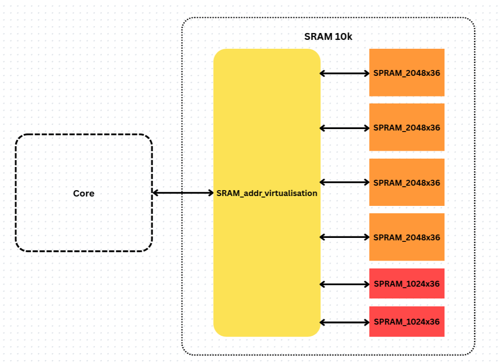
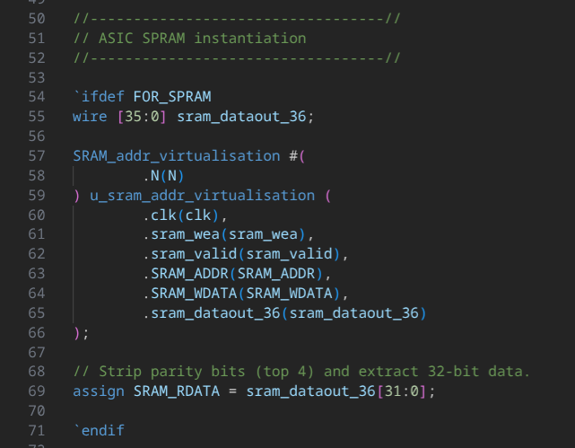

# How the Memory looks for ASIC Synthesis and Tapeout

Unlike the case in sram_2k branch, there isn't a single SPRAM 10k SCL cell available in the PDK. Instead, here we apply a virtualisation logic where multiple __SPRAM_1024x36__ and __SPRAM_2048x36__ SCL cells are used to create a total storage of 10k words of 36 bits each.

The word __"Virtualisation"__ is used here as the core sees a total of 10k words and is not aware that the actual storage is fragmented into multiple smaller cells.

The Virtualisation logic is implemented in [SRAM_addr_virtualisation.v](../../RTL/SRAM_Wrapper/SRAM_addr_virtualisation.v) which calls __*2 x SPRAM_1024x36*__ and __*4 x SPRAM_2048x36*__ SCL cells to create a total of 10k words of 36 bits each.

Here is how it looks like in a block diagram:

In [SRAM_wrapper.v](../../RTL/SRAM_Wrapper/SRAM_wrapper.v) file, the __SRAM_addr_virtualisation__ module is called to implement the virtualisation logic.

