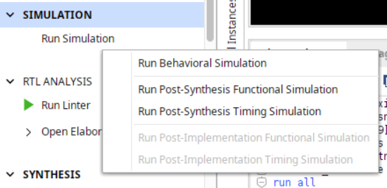
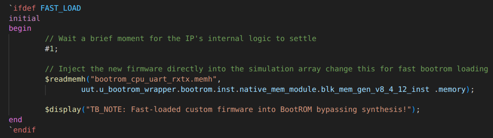
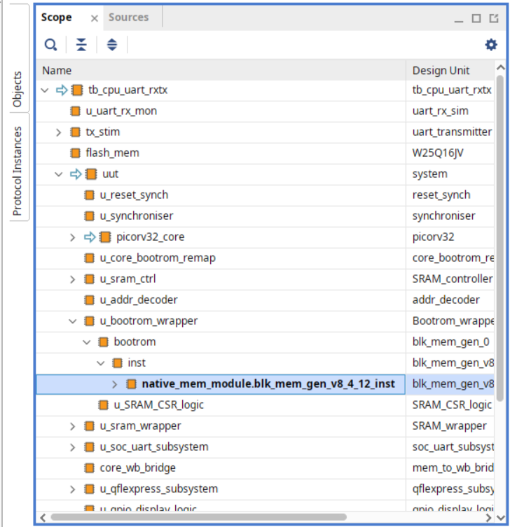
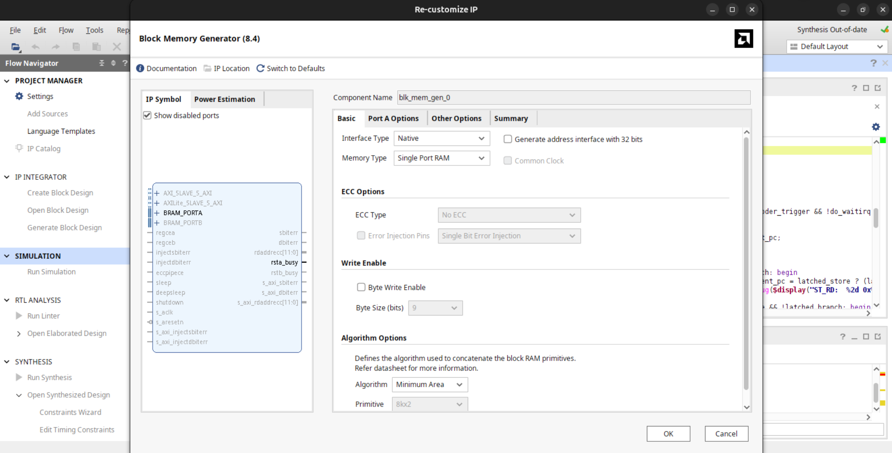
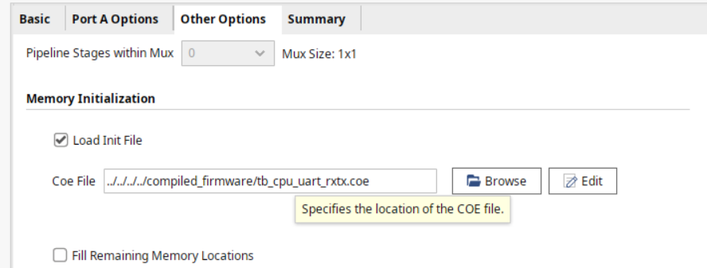
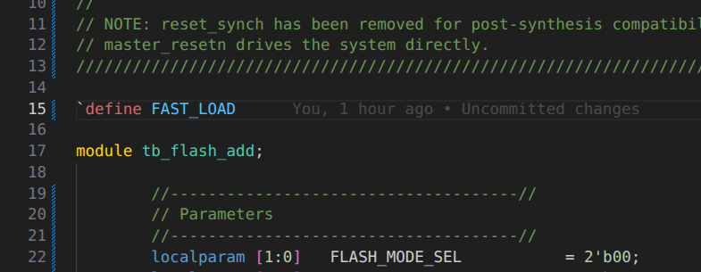
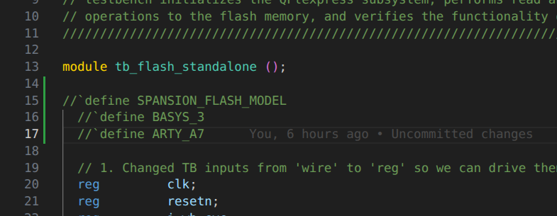
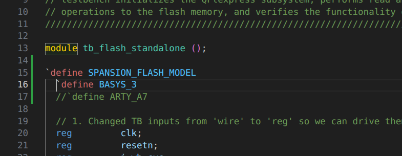

# Steps To Run all the different testbenches

This document provides the steps to run all the different testbenches in this repo. The testbenches are designed to test the flow of different subsystems and main SoC.

## List of all the testbenches and their corresponding top-level modules

| Testbench (TB) | Top Design Module | RTL Path |
| --- | --- | --- |
| tb_boot_controller.sv | boot_controller | RTL/SRAM_Controller/boot_controller.v |
| tb_byte_acc.sv | byte_acc | RTL/SRAM_Controller/UART_Loader_Subsystem/uart_rx_subsystem/byte_acc.v |
| tb_cpu_uart_rxtx.sv | system | RTL/system.v |
| tb_flash_add.sv | system | RTL/system.v |
| tb_flash_standalone.sv | qflexpress_subsystem | RTL/qflexpress_subsystem/qflexpress_subsystem.v |
| tb_flash_with_firmware.sv | system | RTL/system.v |
| tb_UART_loader_subsystem.sv | UART_loader_subsystem | RTL/SRAM_Controller/UART_Loader_Subsystem/UART_loader_subsystem.v |
| tb_reset_synch.sv | reset_synch | RTL/reset_synch.v |
| tb_SRAM_Controller_full.sv | SRAM_controller | RTL/SRAM_Controller/SRAM_controller.v |
| tb_synchroniser.sv | synchroniser | RTL/synchroniser.v |
| tb_uart_add.sv | system | RTL/system.v |
| tb_uart_rx_subsystem.sv | uart_rx_subsystem | RTL/SRAM_Controller/UART_Loader_Subsystem/uart_rx_subsystem/uart_rx_subsystem.sv |
| tb_uart_sram_saturation.sv | system | RTL/system.v |
| tb_uart_with_firmware_flow_control.sv | system | RTL/system.v |
| tb_uart_with_firmware.sv | system | RTL/system.v |
| tb_uart_flow_ctrl_fw.sv | system | RTL/system.v |

---

### Testbenches which can be run directly without any additional setup

 - `tb_boot_controller.sv`
 - `tb_byte_acc.sv`
 - `tb_UART_loader_subsystem.sv`
 - `tb_SRAM_Controller_full.sv`
 - `tb_uart_add.sv`
 - `tb_uart_rx_subsystem.sv`
 - `tb_uart_sram_saturation.sv`
 - `tb_uart_with_firmware_flow_control.sv`
 - `tb_uart_with_firmware.sv`

---

### Asynchronous to Synchronous domain Testbenches

There are 2 testbenches which test the asynchronous to synchronous domain crossing functionality of the design. These are:

 - `tb_reset_synch.sv`
 - `tb_synchroniser.sv`

By default when the design is built using the `vivado_proj_build.tcl` file where timing checks have been disabled. To truely test the asynchronous to synchronous domain crossing functionality, timing checks need to be renabled again in vivado. Using this command:

```tcl
catch {set_property -name {xsim.elaborate.xelab.more_options} -value {} -objects [get_filesets sim_1]} ; catch {set_property -name {xelab.more_options} -value {} -objects [get_filesets sim_1]}
```

Once this is done, the corresponding top module needs to be synthesised. Behavioral simulation will not work for these testbenches as no gate delays are accounted for in behavioral simulation.

 - `reset_synch.v`
 - `synchroniser.v`

Once Synthesis is complete make sure to run Post-Synthesis Timing Simulation to truly test the asynchronous to synchronous domain crossing functionality of the design.



Once done testing, make sure to renable the timing checks again in vivado because the Open Source modules in the SoC run extremely slow in post-synthesis simulation often throwing timing warnings in the simulation log.

To revert back to the default state where timing checks are disabled, use this command in vivado:

```tcl
catch {set_property -name {xsim.elaborate.xelab.more_options} -value {-notimingchecks} -objects [get_filesets sim_1]} ; catch {set_property -name {xelab.more_options} -value {-notimingchecks} -objects [get_filesets sim_1]}
```

---

### Testbenches with 2 methods of loading the BRAM IP.

Testbenches which use the bootrom can be run in 2 different ways:

#### 1. Fast-Loading

 The .memh file with the bootrom firmware can be fast - loaded directly into the bootrom memory.
 -  This allows for faster simulation as the BRAM IP need not be resynthesised everytime the bootrom firmware is changed.



 - This Fast-loading cannot be used for post-synthesis simulation as when BRAM IP is synthesised, this particualr path shown in the image above changes entirely based on the netlist.

__NOTE:__ The path shown in the image above for fast-loading also changes with the version of Vivado used. The path shown above is for __Vivado 2025.2__.

For __Vivado 2024.2__, the path changes to:

```verilog
$readmemh("bootrom_cpu_uart_rxtx.memh",
		...blk_mem_gen_v8_4_9_inst .memory);
```

To check the path for your version of Vivado, open the uut hierarchy in *__scope__* tab of Vivado and see the name of the blk_mem_gen instance:



#### 2. Using .coe files

Alternatively, the BRAM IP can be preloaded with the bootrom firmware using the .coe file in the compiled_firmware folder.

For post-synthesis simulation this is the only way to preload data into the BRAM IP.

Steps to use the .coe file:

1. In the *__Sources__* tab of Vivado, double click on the BRAM_IP instance in the uut hierarchy. This opens the *__Customize IP__* window.



2. Click on *__Other Options__* and then Select *__Load Init File__*.

3. Click on the *__Browse__* button and locate the .coe file in the __`compiled_firmware`__ folder.



4. Click *__OK__* then *__Generate__* to save the changes and close the *__Customize IP__* window.

Files which use these 2 methods are:

 - `tb_cpu_uart_rxtx.sv`
 - `tb_flash_add.sv`
 - `tb_flash_with_firmware.sv`
 - `tb_uart_flow_ctrl_fw.sv`

Here is a comprehensive table for these files and corresponding fast-load .memh files and .coe files used by them:

| Testbench File | Fast-Load .memh File | .coe File |
| --- | --- | --- |
| tb_cpu_uart_rxtx.sv | bootrom_cpu_uart_rxtx.memh | tb_cpu_uart_rxtx.coe |
| tb_flash_add.sv | bootrom_flash_add_tb.memh | tb_flash_add.coe |
| tb_flash_with_firmware.sv | bootrom_flash_path.memh | bootrom.coe |
| tb_uart_flow_ctrl_fw.sv | bootrom_uart_flow_ctrl_fw.memh | tb_uart_flow_ctrl_fw.coe |

To switch between the 2 methods, *uncomment/comment* the `define FAST_LOAD` line in the testbench file.

When commented .coe file needs to be loaded ino BRAM IP before running the simulation.



---

### Testbenches with different behavorial flash memory models

In the repo there are total 3 types of flash memory models used in the testbenches:

 - Winbond flash memory model -> `W25Q16JV`
 - Spansion flash memory model ->
   - `s25fl128s` used in Arty A7 board
   - `s25fl032p` used in Basys3 board

2 testbenches have option to use any one of the 3 flash memory models.

 - `tb_flash_standalone.sv`
 - `tb_flash_with_firmware.sv`

By default, winbond flash memory model is used in these testbenches.



To use the spansion flash memory model, uncomment the `define SPANSION_FLASH_MODEL` line in the testbench file along with ONE of the 2 board specific defines:

 - `define BASYS_3` for Basys3 board
 - `define ARTY_A7` for Arty A7 board

Example for __Basys3__ is shown below:


