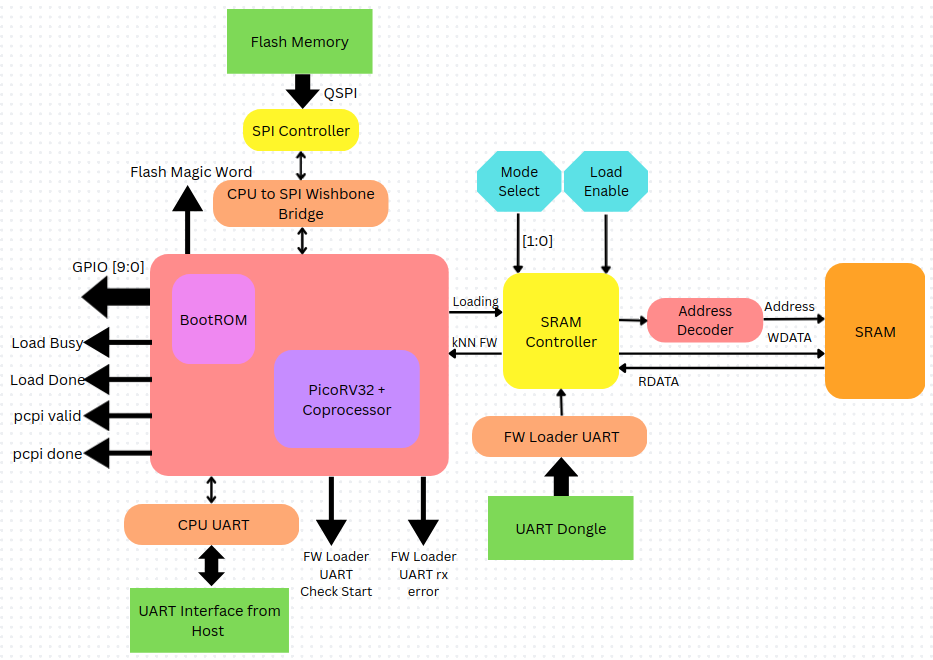
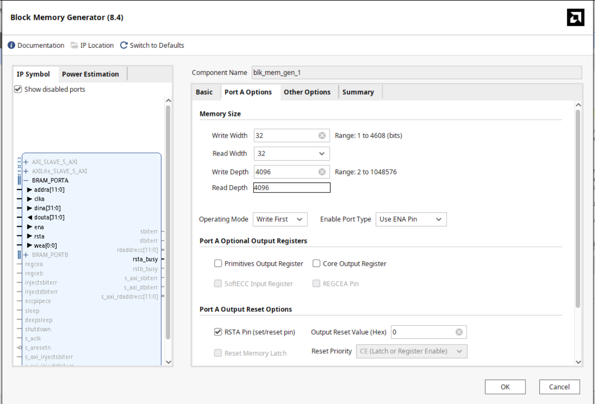
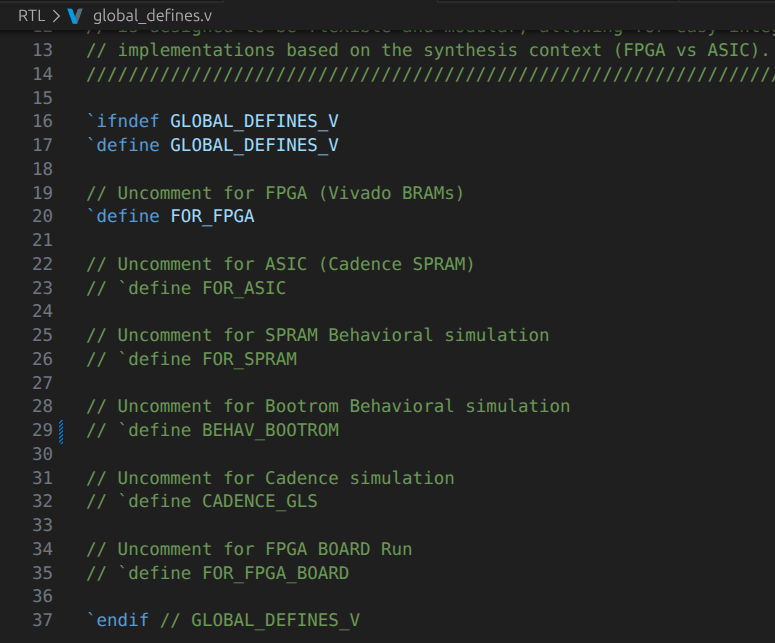
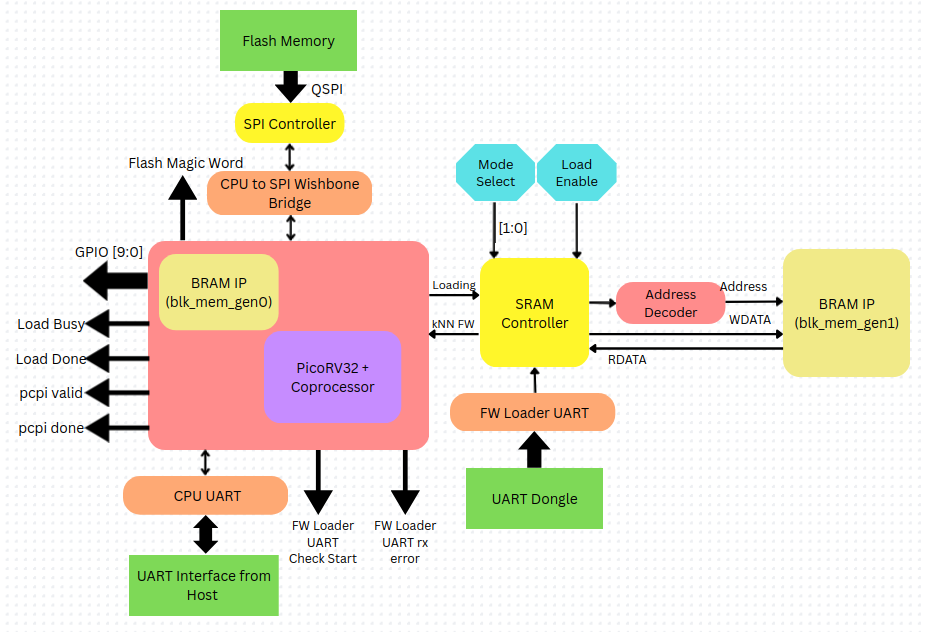
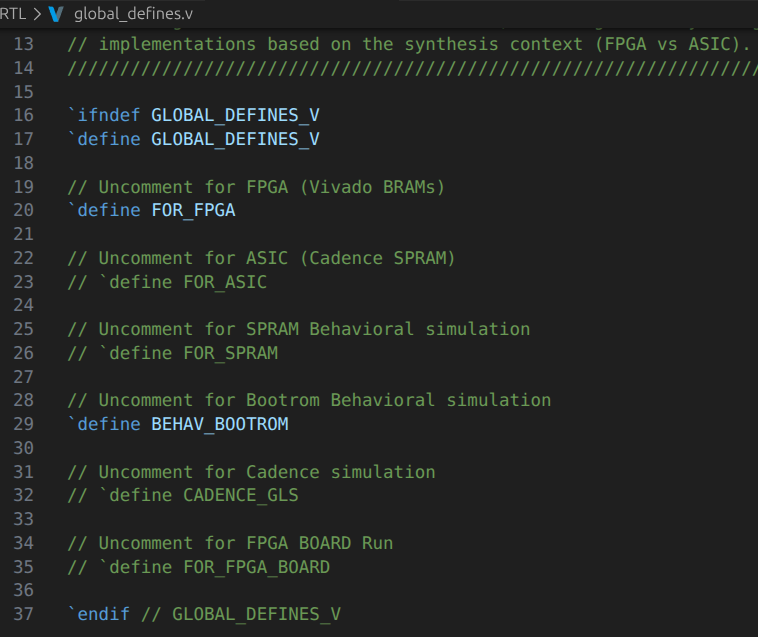
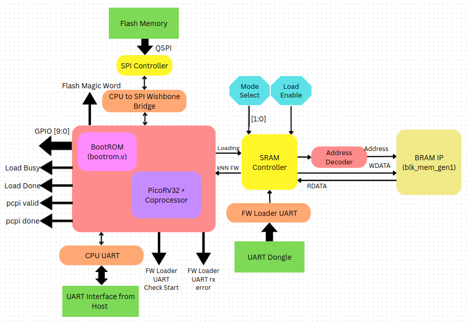
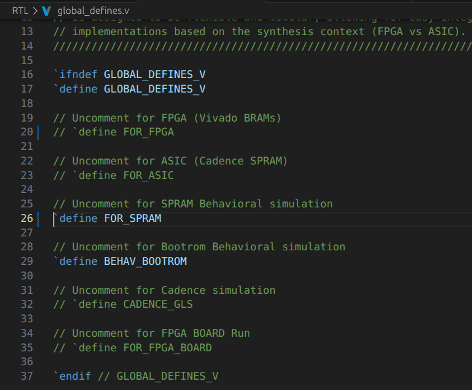
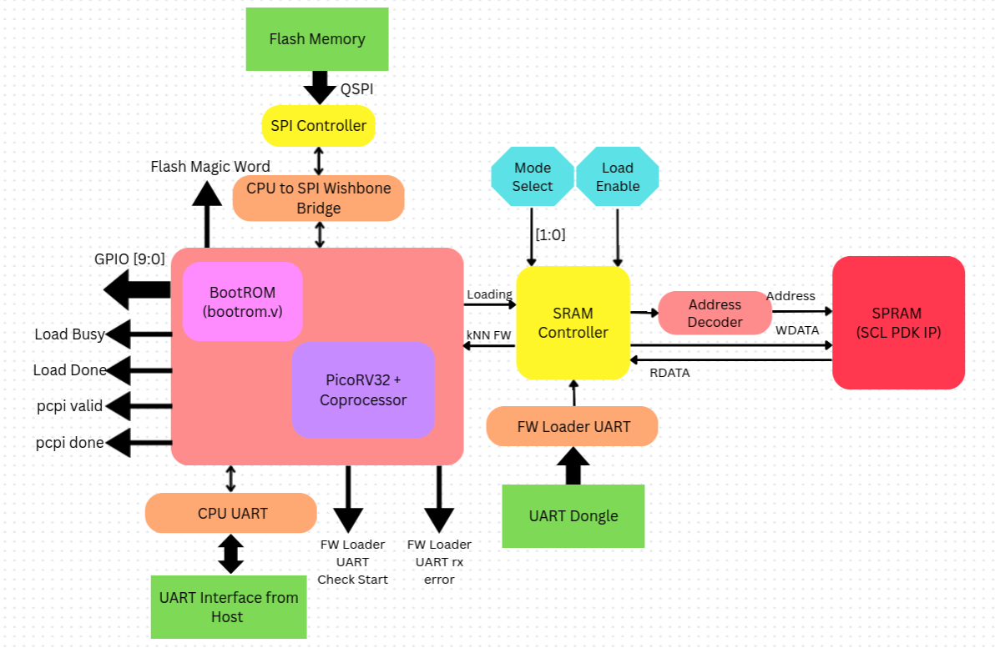
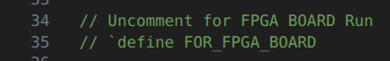
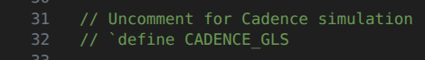

# Different Configurations in which the Design can be setup.

Here is the general Structure of the Design:

The `vivado_proj_build.tcl` script sets 2 files:
 - `global_defines.v`
 - `uart_defines.v`

As __Global Include__. This allows commenting / uncommenting different __*define*__ statements in the `global_defines.v` files to setup the design in different configurations.

The following are the different configurations in which the design can be setup:

---

## Vivado BRAM IPs Configuration

The `vivado_proj_build.tcl` script by default builds and instantiates 2 Vivado BRAM IPs in the design. Both of them have these specifications:
 - Single Port RAM
 - Native Interface
 - 32 bit Write and Read Width
 - 4096 Write and Read Depth (Address Width = 12 bits)
 - rsta pin enabled
 - primitives output register disabled

One BRAM IP acts as the __BootROM__ and the other acts as the __SRAM__.

This is how the `global_defines.v` file should look like:

This makes the design work like this:

In this configuration, ALL the testbenches specific to `system.v` mentioned here in [__testbench-setup table__](../Testbench-Setup/testbench-setup.md#list-of-all-the-testbenches-and-their-corresponding-top-level-modules) can be used to test the design.

---

## BootROM Register file + Vivado BRAM IP SRAM Configuration

This configuration is specific to testing kNN functionality and only works with these `system.v` testbenches mentioned here in [__testbench-setup table__](../Testbench-Setup/testbench-setup.md#list-of-all-the-testbenches-and-their-corresponding-top-level-modules):

 - `tb_flash_with_firmware.sv`
 - `tb_uart_with_firmware.sv`
 - `tb_uart_with_firmware_flow_control.sv`
 - `tb_uart_add.sv`
 - `tb_uart_sram_saturation.sv`

To use this configuration, the `global_defines.v` file should look like this:

This makes the design work like this:

These testbenches
 - `tb_flash_add.sv`
 - `tb_uart_flow_ctrl_fw.sv`
 - `tb_cpu_uart_rxtx.sv`

will not work as they require the BootROM to be a Vivado BRAM IP with different instructions and data.

The BootROM Register file is __HARD-CODED__ data and instructions specific for tapeout and kNN functionality.

---

## BootROM Register file + Cadence SPRAM Slice

This configuration useSPRAM Behavirol model which mimics the Cadence SPRAM Memory block used in tapeout. This configuration is specific to testing kNN functionality and ONLY works with 3 `system.v` testbenches mentioned here in [__testbench-setup table__](../Testbench-Setup/testbench-setup.md#list-of-all-the-testbenches-and-their-corresponding-top-level-modules):

 - `tb_flash_with_firmware.sv`
 - `tb_uart_with_firmware.sv`
 - `tb_uart_sram_saturation.sv`

`global_defines.v` file should look like this:

This makes the design work like this:

---

## Other Configurations

It should be noted that among the 3 major configurations
 - Vivado BRAM IPs Configuration
 - BootROM Register file + Vivado BRAM IP SRAM Configuration
 - BootROM Register file + Cadence SPRAM Slice

__*BootROM Register file + Cadence SPRAM Slice*__ CANNOT be synthesized and deployed on FPGA. It is ONLY for behavioral simulation purposes.

### FPGA Deployment

The other 2 mentioned configurations can be synthesized and deployed on FPGA.

The only other additional configuration required is uncommenting this line in the `global_defines.v` file:

Which allows internal flash of FPGA board to be used.

### Cadence GLS Simulation

Some primitives such as `$finish` in testbenches seem to cause issues in Cadence GLS simulation. To avoid this, uncomment this line in the `global_defines.v` file when running Xcelium simulation:

For detailed instructions on how to fully setup RTL for ASIC Synthesis and tapeout, please refer to [__ASIC Synthesis and Tapeout__](../ASIC-Synthesis-and-Tapeout/asic-synthesis-and-tapeout.md) document.